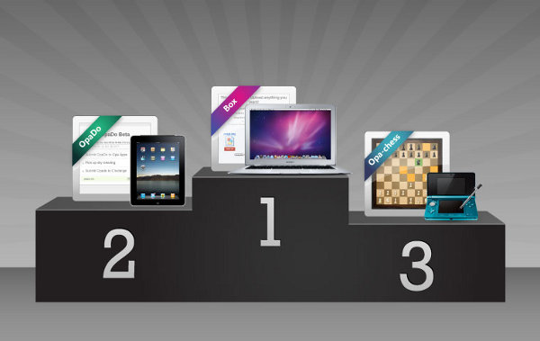

[[chapter_results]]
Opa Developer Challenge: results
--------------------------------

The http://challenge.opalang.org[Opa Developer Challenge] ended 3 weeks ago and since then http://opalang.org/challenge/home.xmlt[the jury] was hard at work deliberating on who deserves the main trophy. It was not an easy choice but in the end we can only have 3 winners, so, without further ado let me present to you the official results of the Opa Developer Challenge 2011.

We decided to give one *honorable mention* to:

* _Matthieu Guffroy_ for his http://ns221022.ovh.net:5023[Opa-Tetris] game. The jury appreciated the original freshness of the Opa-Tetris application -- and acknowledges spending a little bit of extra time playing it.

And the winners of the *main prizes* are:

* The *3rd prize* and the ``Nintendo 3DS'' go to _Mads Hartmann Jensen_, the author of http://ns221022.ovh.net:5023[Opa-chess], a multiplayer chess game. The jury was impressed by the overall design of the game and sees a great potential for the app once optimized.

* The *2nd prize* and the ``iPad 2'' go to  _Tristan Sloughter_ and his http://ns221022.ovh.net:5022[OpaDo] to-do application. It's a clean, simple and easy-to-use application which just works. And in addition to being a modern benchmark of the expresiveness of a programming language or a framework, the series of blogs explaning the different steps of the development was highly appreciated.

* The *1st prize* and the ``Mac BookAir'' go to _Vimalkumar  Jeyakumar_ the author of the http://ns221022.ovh.net:5024[Box], a file sharing app. The jury thinks Box steals the show by being very simple and very well explained since the beginning to the last step. Several members of the jury felt they would like it for the every day use. When does the startup launch?

Without any doubt, these Opa applications have a bright future as open source projects and even startups. We'll have the opportunity to talk about this here soon -- we don't want to spoil the surprise so can't tell more right now :).

We would like to heartily thank all the participants for their submissions and once again congratulate all the winners. We were impressed by the overall quality of the challenge submissions. We hope you had fun developing in Opa and... hope you'll continue making great applications in Opa!
