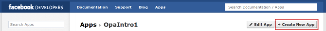

Making friends with Facebook: Introduction
------------------------------------------

Lots of announcements lately, but not many tutorials; time to change it. Hopefully by now you know how easy it is to create web apps in Opa (if you don't and/or are new around here I suggest you explore the history of this blog that has a number of tutorials, also for beginners), but as we all know web apps hardly ever live in isolation. More often than not they interact with other services and platforms. Today I present you with the first article in the series _``Making friends with Facebook''_, that will explore how to interact with Facebook from Opa apps. Ready? You better...

[icons=None, caption="Summary"]
[NOTE]
=======================
You will learn:

* How to use Opa's Facebook API to connect with user's Facebook account.
* How to write a simple Opa app that will show given user's name and the number of her friends (both data obtained from Facebook).
=======================

Setting up a Facebook app
~~~~~~~~~~~~~~~~~~~~~~~~~

To get started we need to create our app's profile on Facebook. To do that go to https://developers.facebook.com. You'll see the following status bar.

Go the Apps (highlighted in the above screenshot) and choose ``Create New App''.

That will open a dialog with basic info about the new application. For now just put +OpaIntro1+ as _App display name_ (we'd prefer something like 'HelloFacebook', but using Facebook trademarks in app names is prohibited) and agree to the Facebook Platform Policies (preferably, after reading ;).

Then (possibly after answering a Captcha) you will be presented with the following settings screen.

Firstly note on the top of the screen the ``App ID'' and ``App Secret'' (they're blurred in the screenshot as the secret *should not be shared* with anyone) -- we will need those values in a minute. Then in the ``Select how your app integrates with Facebook'' section (bottom of the screen; note that we cut out the ``Basic info'' and ``Cloud services'' sections of the settings in the screenshot) select the ``Website'' mark, put the URL at which your application will be hosted -- it's important to get that right as the Facebook login will only redirect to this site's URL -- and click ``Save changes''.

Ok, we're all set on the Facebook side; now let's do some Opa coding!

Writing the Opa application
~~~~~~~~~~~~~~~~~~~~~~~~~~~

The goal of the app is simple: allow users to login via Facebook and upon connection greet them with their name and a quick info on the number of friends they have.

Since we will be using Facebook API, including authentication and http://developers.facebook.com/docs/reference/api[Facebook Graph] to have some basic info about the logged-in user let's start with some imports.

[source, opa]
------------------------
import stdlib.apis.{facebook, facebook.auth, facebook.graph}
------------------------

Then we need to fill in some basic info about the application; we'll put this inside a module.

[source, opa]
------------------------
module OpaIntro1 {

  config =
    { app_id: "xxxxxxxxxxxxxxx"
    , api_key: "xxxxxxxxxxxxxxx"
    , app_secret: "xxxxxxxxxxxxxxxxxxxxxxxxxxxxxxxx"
    }

}}
------------------------

Of course the x's need to be replaced with the real data here -- +app_id+ and +app_key+ are the same (there used to be a distinction) and correspond to ``App ID'' in the Facebook settings screen, whereas +app_secret+ is the value of ``App secret''.

Now we initialize the authentication module with this configuration, make an abbreviation for the Facebook Graph module and define the redirect URL -- this is where Facebook will redirect after authenticating the user.

[source, opa]
------------------------
FBA = FbAuth(OpaIntro1.config)
FBG = FbGraph
redirect = "http://facebook-01.tutorials.opalang.org/connect"
------------------------

Now, we have to handle two pages: the login screen that will show the Facebook connect button and the main screen that is visible after login. Let's start with the main page.

[source, opa]
------------------------
function main() {
  login_url = FBA.user_login_url([], redirect)
  
}
------------------------

The +user_login_url+ function of the authentication module of the Opa Facebook API gives us the URL to redirect to in order to invoke authentication. The first argument is the list of permissions that we require -- for now, we keep it empty. Then we just create a regular link to that address and put a nice image for it. And that's it.

Now let's take a look at the dispatcher of our application:

[source, opa]
------------------------
dispatcher = parser
| "/connect?" data=(.*) -> connect(Text.to_string(data)) |> page
| .* -> main() |> page
------------------------

The +/connect+ page is where we are redirected upon completing authentication (see the +redirect+ variable before); it will have an extra parameter after the question mark, which is the Facebook authentication token that we will use for all functionality requiring Facebook login (in our app: to get some data about the logged-in user). Any other URL in our sample app is handled with the welcome screen that we created above. The +page+ function is just a simple wrapper to create an HTML-page resource (we skip it here but we encourage curious readers to consult the complete listing at the end of the article).

Finally the +connect+ function that takes as an argument the part of the URL after the question mark. First we need to extract a token from this string with

[source, opa]
------------------------
FBA.get_token_raw(data, redirect)
------------------------

which optionally returns a token that we can subsequently use to get some user data. For that we will use the Facebook Graph API, which one can explore at: https://developers.facebook.com/tools/explorer. Two functions that are used for this are:

[source, opa]
------------------------
FBG.Read.object(id, options)
FBG.Read.connection(id, connection, token, paging)
------------------------

For instance reading object +"me"+ (try +https://graph.facebook.com/me+ in the Facebook API explorer) will give basic information about the logged-in user (we will extract name from there), whereas reading connection +"friends"+ of object +"me"+ (try +https://graph.facebook.com/me/friends+) will give the list of user's friends.

The returned data is in http://doc.opalang.org/#!/type/stdlib.core.rpc.core/RPC/Json/json[JSON] format, so we have to do a bit of processing to extract the data we need -- see functions +get_name+ and +get_friends_no+ in the complete listing below for details. Ideally, the API should be extended with more high level functions that would provide a nice mapping from the JSON Facebook API to a type-safe world of Opa (essentially doing what we did in those functions but for all possible objects/connections). This can be done of course (volunteers?) but is a bit complicated by the fact that the shape of the information for different queries depends on application permissions.

So, let us present our first Facebook app in Opa. The complete listing & a link to the running version of the application below.

[source, opa]
------------------------
include::../examples/facebook-01/main.opa[]
------------------------
++++
<A target="_blank" href="http://facebook-01.tutorials.opalang.org">Run</A>
++++

Later we will continue this series of tutorials with examples of some more advanced interactions with the Facebook platform. I'm not sure yet what it will involve so requests and good ideas are welcome -- just drop a comment!
