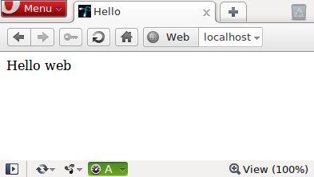

[[chapter_hello_web]]
First steps: ``Hello web'' in Opa
----------------------------------

[icons=None, caption="Summary"]
[NOTE]
=======================
You will learn:

* A bit about Opa's syntax
* Basics of HTML manipulation in Opa.
* Basics of main entry points of Opa programs.
* How to compile your first Opa program.
* How to deploy it (also on many machines).
=======================

Ok, if you read my <<chapter_hello_opa, previous bragging>> about how great Opa is and what it can do to make your life (as a web developer) easier, then you are probably curious to see it in action. I have to admit there won't be too much action in this post, but hey, we need to start with the basics and the sooner we are done with it, the faster we will be able to move to more interesting stuff. Right? Ok, so, shall we start?

The simplest Opa program
~~~~~~~~~~~~~~~~~~~~~~~~

Here it is:
[source, opa]
------------------------
include::../examples/hello_web/hello_web.opa[]
------------------------
++++
<A target="_blank" href="http://hello_web.tutorials.opalang.org">Run</A>
++++

That's the web equivalent of the infamous http://en.wikipedia.org/wiki/Hello_world[``Hello world'' program], only this program instead of printing ``Hello world'' on the console
creates a web service with a single, static web-page titled ``Hello'' and with ``Hello web'' as its content (actually, it does much more than that, but we will come to that in a second).

Ok, now let us take this program apart and introduce some basics of Opa along the way.

Functions in Opa
~~~~~~~~~~~~~~~~
First, let's rewrite the above program into:

[source, opa]
------------------------
page() = <>Hello web</>
server = Server.one_page_server("Hello", page)
------------------------

This program consists of two declarations: a function +page+ and a special declaration +server+ (which we will come to in a few moments). A general syntax of a function is as follows:

[source, opa]
------------------------
my_fun(arg1: type1, ..., argN: typeN) : ret_type =
(
  <fun_body>
)
------------------------

It declares a function called +my_fun+ with +N+ arguments with given names. The return type of the function is +ret_type+. We will say that the type of this function is: +type1, ..., typeN -> ret_type+.

Note, that the enclosing parenthesess are optional in Opa (and were ommited in the ``Hello web'' program). If you think it improves readability you are welcome to put them there, but it's good to know you don't have to.

Also, note that all the type annotations can be usually omitted, as the types will be inferred by the compiler (however, explicitly stating types can often improve readability and maintainability of programs).

[TIP]
.Types in Opa
========================
_Types_ are very important in Opa, which is a http://en.wikipedia.org/wiki/Strongly_typed[strongly], http://en.wikipedia.org/wiki/Static_typing#Static_typing[statically] typed language. The main advantage of a strong, static type system is that many mistakes are caught by the compiler already at compilation time (decreasing the amount of time you will typically spend on debugging afterwards).
=======================

Now, the function declaration of +page+ that we saw earlier is just a special case of this construction, with an empty list of arguments.

But what was this funny arrow (+->+) in the first listing? Well, that's a notation for anonymous functions in Opa.

[source, opa]
------------------------
(x, y -> ...)
------------------------

is a function with two arguments +x+ and +y+. In the first listing the list of function arguments happens to be empty, hence no variable on the left side of the arrow.

(X)HTML in Opa
~~~~~~~~~~~~~~

Ok, so we know that the expression below denotes a function with no arguments.

[source, opa]
------------------------
( -> <>Hello web</>)
------------------------

But what is the body of this function? Well, that's a special XHTML syntax in Opa. Probably it would look more familiar in this form:

[source, opa]
------------------------
( ->  Hello web)
------------------------

In Opa it is perfectly fine to omit names in the closing tags. So instead of:

[source, opa]
------------------------
Hello web
------------------------

you can write:

[source, opa]
------------------------
Hello web</>
------------------------

It is one of many examples showing how Opa lets you decide what's best. You think that having the name in the closing tag improves readability? Be our guest, include them. You'd rather save some keystrokes? That's fine too, +</>+ will close the most recently opened tag for you.

But there is something much more important than the syntax happening here. X(HT)ML is a data-type in Opa. It's important, so let me repeat, this time louder: *X(HT)ML is a data-type in Opa*. Pretty much like strings. (From now on I'll simply write XHTML, but everything I say aplies, more generally, to any XML).

What does it mean in practice? Well, it means that you can easily compose and transform XHTML fragments (allowing to create sites in a compositional matter), store them in data-structures and in the database, etc. etc. For instance let us write a (trivial) function to concatenate two XHTML fragments:

[source, opa]
------------------------
xhtml_concat(x1 : xhtml, x2 : xhtml) : xhtml =
(
  <>{x1}{x2}</>
)
------------------------

or if you'd rather omit types and parenthesses:

[source, opa]
------------------------
xhtml_concat(x1, x2) = <>{x1}{x2}</>
------------------------

the +<>...</>+ are _phantom_ tags, that just delimit XHTML content, but do not create any real tags. The curly braces that we used in the listing above, +{...}+, is the mechanism of _inserts_ of Opa, which allows us to easily (and safely) insert values intro strings and XHTML fragments. For instance compare Opa:

[source, opa]
------------------------
print("{x} + {y} = {x+y}")
------------------------

and Java:

[source, java]
------------------------
System.out.println(x + " + " + y + " = " + (x + y))
------------------------

or

[source, java]
------------------------
System.out.printf("%d + %d = %d", x, y, x+y)
------------------------

Let me conclude this section with a small snippet that hopefully does not require any comment by now (yes, you can use inserts in attributes too):

[source, opa]
------------------------
mk_entry(css_class, header, content) =
  

    {header}</>
    {content}</>
  </>
------------------------

[icons=None, caption="Exercise"]
[NOTE]
=======================
Can you figure out what is the type of this function?
=======================

Entry points in Opa
~~~~~~~~~~~~~~~~~~~

If you run a program in Java, C++ or C# its +main+ method will be called. What happens when you run an Opa program?

Opa is designed for the web. A compiled Opa program is going to function as a web server. The special top-level +server+ value declares such a server (in fact, there can be more than one such declaration).

Our ``Hello web'' program uses a very simple variant of a web-server, that just serves one single page (more realistic services will usually consist of a multitude of pages and resources and we will learn about those later on), created by +Server.one_page_server+ function with two arguments: page title (+string+) and page body (+-> xhtml+, i.e. a function with no arguments and a return value of type +xhtml+).

[source, opa]
------------------------
Server.one_page_server : string, ( -> xhtml) -> service
------------------------

[icons=None, caption="Exercise"]
[NOTE]
=======================
Take a look at the online, browsable http://opalang.org/resources/doc/index.html[Opa API] and find the declaration for +Server.one_page_server+. Read the documentation. What are other ways of creating a server in Opa?
=======================

Compiling, deployment, execution
~~~~~~~~~~~~~~~~~~~~~~~~~~~~~~~~

[CAUTION]
=======================
I'm assuming here that you have Opa installed on your machine. If that's not the case please follow http://opalang.org/resources/book/index.html#Getting_Opa[the instructions] in the manual.
=======================

If you saved the program from the beginning of this post in a file +hello.opa+ then you can compile it with:

[source, bash]
------------------------
opa hello.opa
------------------------

You will notice that the compilation takes somewhat long for such a simple program (7 sec for me) and the executable is rather big (30 MB for me, though that may vary depending on the compiler version). What makes it so? Well, it's good to realize that in Opa the executable (even for such a simple program) contains: a complete HTTP server, database management system (DBMS), distribution engine and so on. That gives a little initial overhead both in compilation time and the size of the executable... but the fact that those components come integrated in Opa is what makes it so powerful!

Now you can run the produced web application with:

[source, bash]
------------------------
./hello.exe
------------------------

That will run the web server on the default port (8080). You can change this default with +--port+ or +-p+ switches (note, that you will need administrator rights to run the server on the standard HTTP port, that is 80). You can also try the +--help+ switch to obtain a complete list of arguments with which you can customize your server.

You can also compile and run in one step with:

[source, bash]
------------------------
opa hello.opa --
------------------------

Everything after the two dashes will be passed as arguments to the produced executable.

You can also deploy your web app in the cloud with a simple:

[source, bash]
------------------------
opa-cloud-spawn.sh hello.exe --host localhost --host my@my_server1 --host my@my_server2
------------------------

[CAUTION]
=======================
The cloud deployment tools are a work in progress and your version of the compiler may not yet (fully) support it.
=======================

To organize bigger developments you can use Makefiles. Opa compiler also accepts +.opack+ files which are collections of files to compile, one file-name per line.

Once you run your web application, point your browser to http://localhost:8080 (or whatever machine you deployed it on) and _voil&agrave;_:

The result is maybe not so impressive but it's a one-liner that we are talking about, ok? :). I promise a little more excitement in the next post (hint: we'll go interactive!). So stay tuned!
