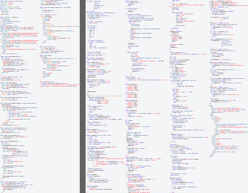

[[chapter_opa_vs_node_js]]
Node.js VS Opa
--------------

In today's article we will try to see how two uprising programming languages for the web stack against each other: http://nodejs.org/[Node.js] and http://opalang.org/[Opa].

On first sight they have quite a bit in common: both are targeting development of web applications; both have the huge benefit of a single language for both client and server-side coding. However, there are also many important differences: Node.js is based on the well-known Javascript, whereas Opa introduces a completely new language; Node.js (as Javascript) is untyped whereas Opa is strongly typed _etc. etc._. We'll try to look more closely at those differences, and their implications, in the remainder of this article.

[icons=None, caption="Disclaimer"]
[NOTE]
=======================
Even though this blog is endorsed by Opa, I really strived for an unbiased presentation here. However, knowing Opa inside out and Node.js substantially less so, there's a chance some ommisions slipped in. In that case I'd be obliged if you could point that out in the comments so I could fix it. Thanks.
=======================

The contenders
~~~~~~~~~~~~~~

Node.js is a framework for writing web servers, built on top of http://en.wikipedia.org/wiki/V8_(JavaScript_engine)[Google's V8 JavaScript engine]. It's event-driven and uses asynchronous I/O to minimize overhead and maximize scalability. It was started in 2009 by Ryan Dahl. Node.js allows to write server-side code in Javascript, hence making it possible to use the same language for both client- and server-side coding.

image::img/logo_opa.png[float="left", link="http://opalang.org"]

Opa is an open source platform for developing web applications. It consists of a new programming language, a new web server, a new database and a new distributed execution engine, all of them tightly integrated to provide a great experience for web developers. It uses a similar asynchronous model to that of Node.js, but goes even further by supporting (out of the box) distribution of the application across multiple machines (or in the cloud). It's development was started before 2008 by Henri Binsztok and subsequently was continued by http://mlstate.com[MLstate], a company he founded.

The arena
~~~~~~~~~

To illustrate and compare those two langauges we will use the example that is slowly becoming a standard benchmark for web frameworks/languages: a web chat. It's not a bad benchmark as it involves extensive client-server communication.

Below we present screenshots of chats developed, respectively, in Node.js (by Ryan Dahl, the author of Node.js himself) and in Opa (by https://github.com/Aqua-Ye[Frederic] from the Opa team). We encourage you to click on the images to play with the live application. Both applications are equivallent feature-wise (though not visually).

|====
| image:img/chat_node.png[link="http://chat.nodejs.org/"] | image:img/chat_opa.png[link="http://opa_chat.tutorials.opalang.org"]
|====

Below we will try to compare differences aspects of building this application with Node.js and in Opa.

Productivity
~~~~~~~~~~~~

Developer productivity is one of the very important aspects of choosing one's tools. If you can develop fast it means you can innovate, you can quickly create prototypes, you can quickly change things and react to changing market and user needs... the list goes on and on.

There are many pitfalls of using http://en.wikipedia.org/wiki/Source_lines_of_code[SLOCs] (Software Lines of Code) as a metric to compare productivity, but they are a good estimate and can give an impression of the effort needed to develop something. Instead of presenting raw numbers below we show a bird's-eye-view on the source code of the two projects, after removing comments & new lines (for Node.js https://github.com/ry/node_chat[sources] we only included +client.js+ and +server.js+ as the remaining files can be considered to belong to the standard library). The Opa project is on the left & Node.js is on the right.

This visual image more or less reflect comparing gzipped (standard measure to avoid identifier length impact) size of the sources, where the Node project is roughly twice longer (1.95x to be exact). So Opa seems to be significantly more concise, the effect of which is probably strenghtened by the fact that the Opa chat additionaly features the list of people currently present in the chat-room and GitHub's ``Watch'' and ``Fork'' buttons (with a somewhat verbose HTML).

////
++++

++++
[source,opa]
---------------------
include::chat.js[]
---------------------
++++

++++
////

Server/client side separation & communication
~~~~~~~~~~~~~~~~~~~~~~~~~~~~~~~~~~~~~~~~~~~~~

The final strike: debugging
~~~~~~~~~~~~~~~~~~~~~~~~~~~

Conclusions
~~~~~~~~~~~

Growing popularity of projects such as Node.js or Opa, but also GWT, Ruby on Rails and others, which unify client and server-side coding, is a clear indication that the web of today is too complex and the programming model needs to be simplified. I hope this article I managed to indicate that Opa is not just ``yet another framework'' and that it really has something to offer in this programming landscape. For instance it's worth noting that none of the mentioned solutions features static, strong typing and hopefully I made a case above that this is a very important feature that you won't be able to live without, once you get to know it. So, indeed, why not get to know it? :). This blog and the friendly Opa community will help you make your first steps in the Opa world.
