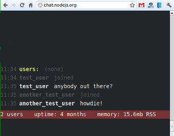

[[chapter_opa_vs_node_js]]
Node.js VS Opa
--------------

In today's article we will try to see how two uprising programming languages for the web stack against each other: http://nodejs.org/[Node.js] and http://opalang.org/[Opa].

On first sight they have quite a bit in common: both are targeting development of web applications; both have the huge benefit of a single language for both client and server-side coding. However, there are also many important differences: Node.js is based on the well-known Javascript, whereas Opa introduces a completely new language; Node.js (as Javascript) is untyped whereas Opa is strongly typed _etc. etc._. We'll try to look more closely at those differences, and their implications, in the remainder of this article.

The contenders
~~~~~~~~~~~~~~

image::img/logo_nodejs.png[float="left", link="http://nodejs.org"]

Node.js is a framework for writing web servers, built on top of http://en.wikipedia.org/wiki/V8_(JavaScript_engine)[Google's V8 JavaScript engine]. It's event-driven and uses asynchronous I/O to minimize overhead and maximize scalability. It was started in 2009 by Ryan Dahl. Node.js allows to write server-side code in Javascript, hence making it possible to use the same language for both client- and server-side coding.

Opa is an open source platform for developing web applications. It consists of a new programming language, a new web server, a new database and a new distributed execution engine, all of them tightly integrated to provide a great experience for web developers. It uses a similar asynchronous model to that of Node.js, but goes even further by supporting (out of the box) distribution of the application across multiple machines (or in the cloud). It's development was started before 2008 by Henri Binsztok and subsequently was continued by http://mlstate.com[MLstate], a company he founded.

The arena
~~~~~~~~~

To illustrate and compare those two langauges we will use the example that is slowly becoming a standard benchmark for web frameworks/languages: a web chat. It's not a bad benchmark as it involves extensive client-server communication.

Below we present screenshots of chats developed, respectively, in Node.js (by Ryan Dahl, the author of Node.js himself) and in Opa (by https://github.com/Aqua-Ye[Frederic] from the Opa team). We encourage you to click on the images to play with the live application. Both applications are equivallent feature-wise (though not visually).

|====
|  | 
|====

Below we will try to compare differences aspects of building this application with Node.js and in Opa.

Productivity
~~~~~~~~~~~~

After the coding: debugging game
~~~~~~~~~~~~~~~~~~~~~~~~~~~~~~~~
