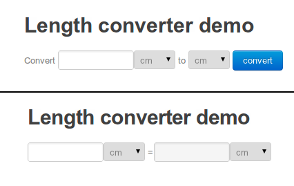

Units of measurement: improving UX
----------------------------------

After presenting the <<chapter_units, previous post>> about a simple http://tutorials.opalang.org/unit_convert[unit converter] we received some feedback saying that our interface of that example was not perfect; it seems that people don't like to http://www.google.com/instant/[press buttons] anymore :). While the focus of that example was on other things (UI design patterns and dealing with custom types) we're here to please so in this post we will improve the interface and along the way hopefully learn a thing or two.

[icons=None, caption="Summary"]
[NOTE]
=======================
You will learn:

* More about useful UI design patterns.
* How to create reactive apps.
* How to boost their looks with <<chapter_hello_bootstrap, Bootstrap>>.
=======================

The following image shows the previous click-to-get-result interface (top) compared to the interface we will develop in this post (bottom). In this new interface we will simply have two boxes with values and units of length and changing one will update (on the fly, as one types) the other. To make things less confusing we will also make the right value read-only and always convert from left to right.

However, this time let's change the rules of the game a bit. The primary goal of this blog is to help you guys out there learn Opa. So far I was doing it by showing you small programs and explaining them step-by-step, illustrating some Opa features along the way. However, we all know that the best way to learn things is by _doing_. So today instead of a detailed walk-through I have an exercise for you my Dear Readers.

[icons=None, caption="Exercise"]
[NOTE]
=======================
Change the code from the <<chapter_units, previous post>> to implement the UI presented and explained above.
=======================

I suggest you look at my solution below, only when you have completed the exercise. Or got hopelessly stuck. Make no mistake: doing this exercise _cleanly_ may be a bit challenging, especially if you have no prior experience in Opa (apart from reading this blog). To slightly ease this task, let me provide you with a few hints:

* I suggest you start with a completely symmetric design, i.e. having two conversion boxes, where changing one changes the other and only afterwards break this symmetry by making the right box read-only and the conversion always from-left-to-right.
* Before we had UI classes +Ui.getter+ (+Ui.input+: text input field and +Ui.select+: selection field) and +Ui.setter+ (+Ui.display+: text label). Now with the more symmetrical design I suggest you have instead only one class +Ui.editable+ which combines the functions of a +Ui.getter+ and +Ui.setter+ and two instances of it: +Ui.select+: selection field and +Ui.input+: text field; both allowing edition.
* Moreover you'll need to somehow be able to react to changes in those controls. I suggest you register callbacks for when the controls change; they can be provided as an argument to +xhtml+ function which produces the code for the control and which will subsequently fire them on +onchange+ events for HTML controls.

Btw. I changed both this and the previous example to use <<chapter_hello_bootstrap, Opa Bootstrap>>. What it amounts to is adding:
[source, opa]
------------------------
import stdlib.themes.bootstrap
------------------------
in your program and then consistently using http://twitter.github.com/bootstrap/[Bootstrap's] class names and mark-up conventions. Yes, it's really that simple.

Ok, here is the solution I came up with (*so don't look at the code below if you did not complete the exercise above :)*). Don't get daunted, I did not get there immediately (but rather iteratively, improving and cleaning things along the way). Don't be afraid to do things wrong -- this is all part of the learning process :).

++++

++++
* <<units, units.opa>>
* <<ui, ui.opa>>
++++

++++
[source,opa]
---------------------
include::../examples/unit_converter_plus/units.opa[]
---------------------
++++

++++
[source,opa]
---------------------
include::../examples/unit_converter_plus/ui.opa[]
---------------------
++++

<A target="_blank" href="http://tutorials.opalang.org/unit_converter_plus">Run</A>
++++
