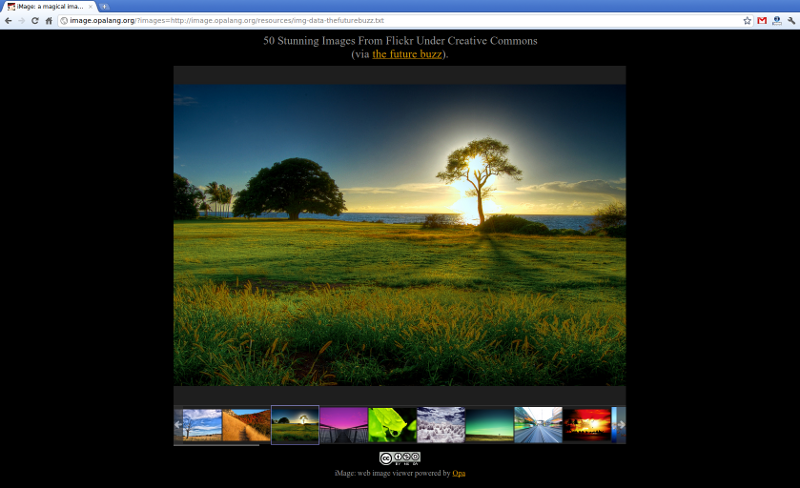

[[chapter_image_intro]]
iMage: developing an image viewer in Opa
----------------------------------------

Few days ago I <<chapter_challenge_announcement, promised>> you some news regarding the upcoming contest of the blog; let's hope you will like what I have to say.

I was thinking about the kind of things that I want to talk about on this blog. So far I presented few toy examples and I think I will continue to do so -- small examples, nicely extracting relevant features can go a long way to understanding more about the language.

But if you are anything like me, then you are probably anxious to also see ``the real stuff'' :). Hence my new idea of presenting more substantial applications and offering complete walkthroughs of their development. So last week I've been busy at work and now let me proudly present to you: http://iMage.opalang.org/?images=http://image.opalang.org/resources/img-data-thefuturebuzz.txt[iMage]; a photo viewer developed in Opa (http://iMage.opalang.org/?images=http://image.opalang.org/resources/img-data-thefuturebuzz.txt[click] for a running version).

Few things to note when you're trying it out:

* Don't you think the phase of showing progress of loading all the photos is cool? If you don't you can press ``Go'' even   before everything is loaded.
* Be sure to hover over photos for descriptions.
* Try re-sizing the window, the app should accommodate nicely.
* There may be few glitches (for instance the aspect ratio of photos will get wrong in IE; the scroll-bar in the thumbnail area will lag behind when resizing the window, ...) -- I had the choice to iron those out and post in a couple of days or go with this version now; I hope I made the right choice :).
* The list of photos to show & their captions are configured with a simple mark-up; for instance you can see the configuration of the photos above http://image.opalang.org/resources/img-data-imagen.txt[here].
* in fact this configuration is passed to iMage via the URL (look at the address bar while watching the app); that means that with little effort you should be able to make a presentation of your on-line photos :) (you may need to be patient though, as error handling is very minimal for now).
* You can see another selection of photos http://iMage.opalang.org/?images=http://image.opalang.org/resources/img-data-imagen.txt[here] (both configurations are hosted together with iMage and in both cases the photos themselves come from http://www.flickr.com[Flickr], but neither is required).

So in the coming posts (it'll take a few of them) I'll be offering a detailed walkthrough of developing this application -- I hope this will prove interesting?

You may be wondering why an image viewer? After all: it works almost distinctly on the client, does not use a database, nor complex client-server communication, nor complex application distribution (between clients and servers)... in short non of the features that Opa excels at :). So if you eat JavaScript for breakfast chances are you will not be thoroughly impressed as you could achieve a similar effect with comparable effort with JS (I guess, I'm not so big on JS myself). My hope though is that you will see that developing client-side stuff with Opa is as easy (or easier?) than with JavaScript, while on top of that Opa is offering you strong, static type-system (you'll come to appreciate that after comparing the amount of debugging required to get an Opa app running, as compared to some dynamically typed language, trust me on that). Then, by the time we'll put all those cool aforementioned features on top of the pile (without switching programming language, framework or paradigm...), I hope you'll realize that Opa is, well, indispensable :).

I still think that this app is interesting as:

* It introduces concepts required to build *rich user interfaces* with Opa.
* The final app takes the photos from a given URL but we will start with photos embedded in the app. This will allow me to talk about *working with resources* in Opa (including *external CSS*).
* Parsing application input via its URL will be a good opportunity to briefly talk about building *REST-style services*.
* parsing the application's configuration file (with a list of photos to display & their captions) will be an excellent opportunity to explain Opa's *parsing capabilities*.
* In the loading phase did you notice that photos that are ready are lighting up, then there is a check-mark over them and when everything is ready the ``Go'' button is pulsating for a second or two? This little effect is achieved using jQuery's http://docs.jquery.com/UI/Effects/Pulsate[pulsate] effect, which is part of the http://jqueryui.com/[jQuery UI]. Since jQuery UI is not available by default from Opa (only jQuery is), we will use this as an opportunity to show how easy it is to *bind external JS libraries*.

Sounds interesting? I hope it does. If you have any comments regarding iMage or this plan... you know what to do :).
